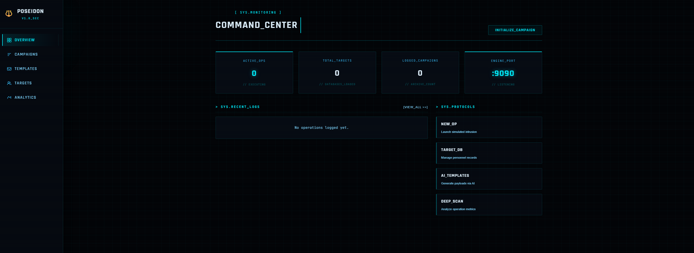

# 🔱 Poseidon

> Poseidon - god of the sea, shaker of the earth, destroyer of fleets, commander of storms...
> ...is a phishing simulation platform for security awareness training.
>
> Yeah. He traded his trident for an SMTP server. Times are tough.



Much like his domain, Poseidon runs deep:

* 🔱 **Engine** - Rust-powered core that creates, manages and fires phishing campaigns with zero mercy
* 🌊 **Dashboard** - React web UI for campaign management, template building and target lists
* 📊 **Observability** - Grafana, Prometheus and Loki stack showing exactly who clicked what and when

Built for security teams to test their own organizations. If you're using this anywhere you don't have explicit written authorization, that's not a Poseidon problem, that's a you problem.

---

## ⚠️ Legal Disclaimer

**Poseidon is strictly for authorized security awareness training within organizations you are explicitly permitted to test.**

Unauthorized use of this tool against systems or individuals without written consent is illegal and unethical. The authors accept zero liability for misuse. By using this software you confirm you have explicit written authorization from the target organization's appropriate authority.

This tool is intended for:
- Internal security teams running authorized phishing simulations
- Penetration testers operating under a signed statement of work
- Security awareness program managers with organizational approval

If you're unsure whether you have authorization, you don't.

---

## What This Project Is and Why It Exists

Phishing is still the number one attack vector responsible for the majority of breaches. Yet most organizations run zero simulation exercises and have no idea how vulnerable their employees actually are. Poseidon bridges that gap — giving security teams an enterprise-grade awareness training platform without the enterprise price tag.

Most open source phishing tools stop at sending emails. Poseidon goes further — it generates personalized emails using a local AI model, tracks every open, click and form submission per target, exposes real-time Prometheus metrics, ships structured logs into Loki, and displays everything in a pre-built Grafana observability stack. The same infrastructure pattern real SOC teams use at scale.

Honestly? I also just wanted to know how the pros actually do it. Understanding the mechanics of a phishing campaign — tracking pixels, unique redirect links, SMTP delivery, DKIM considerations — is the kind of hands-on knowledge you don't get from a textbook. Building the weapon is the fastest way to learn how to defend against it. And if it lands a job along the way, that works too.

---

## What I Actually Built

This is not a tutorial follow-along. Every line of code was written from scratch. Here is what the system does end to end:

**1. Campaign management**
A security operator creates a phishing campaign through the React dashboard — sets the sender identity, subject line, target group, redirect URL and campaign theme. The theme is a natural language description like "IT password reset" or "HR open enrollment" that gets passed to the AI.

**2. AI email generation**
When a campaign launches, the Rust engine calls a locally hosted Ollama instance running `llama3.1:8b` on GPU. For every target in the group, it generates a completely unique, personalized phishing email based on the target's name, job title, department and the campaign theme. No two emails are identical. No API costs. No data leaving the network.

**3. SMTP delivery with per-target tracking**
Each email contains a unique SHA-256 derived tracking token embedded in every link and a 1x1 pixel image. The mailer fires emails concurrently via a Tokio semaphore-controlled worker pool — 10 concurrent SMTP connections, no relay hammering.

**4. Real-time event tracking**
When a target opens the email, the tracking pixel fires to `/t/o/:token`. When they click a link, `/t/c/:token` logs it and redirects. When they submit a credential capture form, `/t/s/:token` stores the payload as JSONB. Every event is logged with IP address, user agent, timestamp and campaign context.

**5. Observability stack**
Prometheus scrapes the engine's `/metrics` endpoint every 10 seconds. Loki receives structured JSON logs from every container via Promtail. Grafana serves pre-built dashboards showing click rates, open rates, submission rates, AI generation latency and SMTP throughput — all wired up automatically on `docker compose up`.

**6. One command deployment**
`docker compose up` spins up 8 services: Rust engine, React dashboard, PostgreSQL, Ollama, Prometheus, Loki, Promtail and Grafana. GPU passthrough for Ollama is handled automatically via the NVIDIA Container Toolkit.

---

## Tech Stack and Why

| Component | Technology | Why |
|-----------|------------|-----|
| Engine | **Rust** | Handling real employee data, credential submissions and tracking events at scale. Memory safety and zero-cost async are not optional. `tokio` gives true concurrent SMTP delivery without thread overhead |
| Dashboard | **React + Vite** | The UI needs to be usable by non-technical security managers. React's component model kept the campaign, template, target and analytics pages maintainable |
| AI generation | **Ollama + llama3.1:8b** | Local inference means target names and emails never leave the network. No API costs at scale. GPU-accelerated on an RTX 3080 — sub-2-second generation per email |
| Database | **PostgreSQL** | UUID primary keys, JSONB for event payloads, custom enums for campaign lifecycle states, full-text indexable event logs |
| Observability | **Prometheus + Loki + Grafana** | The same stack real SOC teams run. Not a classroom project. Pre-built dashboards load automatically — no manual setup |
| Deployment | **Docker Compose** | 8 services, one command. GPU reservation, named volumes, internal networking, log shipping — all configured |

---

## Architecture

```
┌─────────────────────────────────────────────────────────┐
│                    Docker Network                        │
│                                                          │
│  ┌──────────┐    ┌──────────┐    ┌──────────────────┐   │
│  │  React   │───▶│  Rust    │───▶│   PostgreSQL     │   │
│  │Dashboard │    │ Engine   │    │  (campaigns,     │   │
│  │ :3000    │    │  :8080   │    │  targets, events)│   │
│  └──────────┘    └────┬─────┘    └──────────────────┘   │
│                       │                                  │
│              ┌────────┼────────┐                         │
│              │        │        │                         │
│         ┌────▼──┐ ┌───▼────┐ ┌▼──────────┐             │
│         │Ollama │ │Metrics │ │   SMTP     │             │
│         │:11434 │ │ :9090  │ │  (external)│             │
│         │GPU    │ └───┬────┘ └────────────┘             │
│         └───────┘     │                                  │
│                  ┌────▼──────┐                           │
│                  │Prometheus │                           │
│                  │  :9091    │                           │
│                  └────┬──────┘                           │
│                       │                                  │
│  ┌──────────┐    ┌────▼──────┐    ┌──────────────┐      │
│  │ Promtail │───▶│   Loki    │───▶│   Grafana    │      │
│  │(log ship)│    │  :3100    │    │    :3001     │      │
│  └──────────┘    └───────────┘    └──────────────┘      │
└─────────────────────────────────────────────────────────┘
```

---

## Security Design Decisions

**Why local AI instead of an API?**
Target names, email addresses, job titles and departments are sensitive personal data. Sending that to OpenAI or Anthropic to generate phishing emails creates a data handling problem. Ollama runs entirely on-premise — the data never leaves the machine.

**Why Rust for the engine?**
The engine handles credential submissions — form data that targets type into fake login pages. A memory safety vulnerability in that code path is not acceptable. Rust eliminates that class of bug entirely at compile time.

**Why SHA-256 tokens instead of sequential IDs?**
Sequential IDs in tracking URLs are enumerable — an attentive target could guess other people's tracking links. SHA-256(campaign_id + target_id + server_secret) gives unpredictable, non-enumerable tokens with no collision risk at typical campaign sizes.

**Why structured JSON logging?**
Every campaign event — send, open, click, submission, report — is logged as structured JSON with full context. This feeds directly into Loki where security teams can query "show me every credential submission from the Finance department in the last 7 days" without touching the database.

---

## Features

### 🔱 Rust Engine
- Full campaign lifecycle: Draft → Active → Paused → Completed → Archived
- AI-personalized email generation via Ollama — unique email per target
- SMTP delivery with concurrent worker pool (semaphore-controlled)
- Per-target unique tracking tokens (SHA-256 derived)
- Open pixel tracking, click tracking, form submission capture
- Prometheus metrics endpoint with histograms for latency tracking
- Structured JSON logging for Loki ingestion
- PostgreSQL with automatic migrations on startup
- Full REST API consumed by the dashboard

### 🌊 React Dashboard
- COMMAND_CENTER overview with live campaign stats
- Campaign management — create, launch, pause, complete
- AI theme prompt — describe the attack scenario in plain English
- Target group management with CSV bulk import
- Email template builder with Ollama AI generation mode
- Analytics page with risk scoring and campaign comparisons
- Real-time engine health polling in sidebar

### 📊 Observability
- Prometheus: click rates, open rates, submission rates, AI latency, SMTP latency
- Loki: structured event logs queryable by campaign, target, department
- Grafana: pre-built dashboard with time-series graphs, gauges, log panel
- All three auto-provisioned on startup — no manual configuration

---

## Quick Start

```bash
# Clone
git clone https://github.com/MohammedAsadKhan/Poseidon.git
cd Poseidon

# Configure
cp .env.example .env
# Edit .env — set POSTGRES_PASSWORD, GRAFANA_PASSWORD, TRACKER_SECRET

# Launch everything
docker compose up -d

# Pull the AI model (first time only — ~5GB)
docker exec -it poseidon-ollama ollama pull llama3.1:8b
```

| Service | URL |
|---------|-----|
| Dashboard | http://localhost:3000 |
| Grafana | http://localhost:3001 |
| Engine API | http://localhost:8080 |
| Prometheus | http://localhost:9091 |

---

## Hardware Used

Built and tested on a Ryzen 9 5900X + RTX 3080 (10GB VRAM) + 32GB RAM running Windows with WSL2 and Docker Desktop. The RTX 3080 runs `llama3.1:8b` entirely in VRAM — generation latency under 2 seconds per email.

For development without a GPU, set `MOCK_AI=true` in `.env` — the engine returns a labeled mock email instantly without calling Ollama.

---

## Inspired By

Architecture inspired by [GoPhish](https://github.com/gophish/gophish). Built from the ground up in Rust + React with a full observability stack for modern security teams that need more than a checkbox tool.

---

## License

MIT - see [LICENSE](LICENSE)

---

*Poseidon doesn't ask if you're ready. He just sends the wave.*
